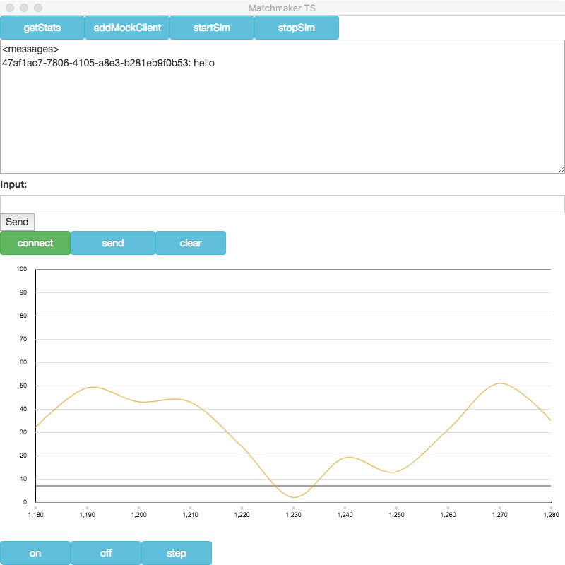
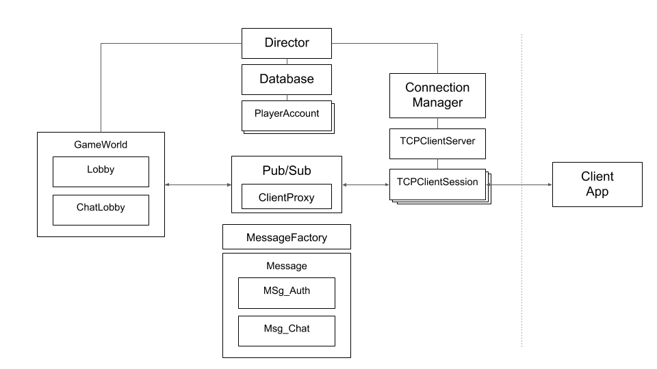

## matchmaker-ts



matchmaker-ts is a tool for designing and analyzing multiplayer matchmaking.  


### Build & Run

```bash
yarn
yarn start
```

### Documentation

[https://wwlib.github.io/matchmaker-ts/typedoc/index.html](https://wwlib.github.io/matchmaker-ts/typedoc/index.html)

### Getting Started


### Overview and Architecture

matchmaker-ts is a real time multiplayer server written in TypeScript with an Electron/React front-end.  



#### Director
The Director coordinates the subsystem.
- Instantiates the ConnectionManager
- Manages communication with the Database
- Manages the lifecycle of Lobbies
 - whenever a new player connects, the Director either:
  - adds the player to an existing Lobby or
  - creates a new Lobby appropriate for that player
- Manages the lifecycle of authenticated TCPClientSessions
- Creates and destroys ClientProxy instances used to relay messages between TCPClientSessions and GameWorlds (Lobbies)
- Manages the creation of clients used for testing the server
 - mock clients are a mock TCPClientSession and ClientProxy
 - mock clients are added to Lobbies just like actual clientSession
- Manages the creation of (mock) PlayerAccounts

Pub/Sub
- The Director currently uses a local/in-memory pub/sub module (PubSubJS) to relay messages between TCP connections and Lobby/GameWorlds
- Greater scalability could be achieved by using Redis which would allow messages to be shared between multiple server instances

Primary/Replica
- The Director is designed to have two modes: Primary and Replica (unimplemented)
- In Primary mode, the Director acts as the authoritative Database and owner of Lobby/GameWorld instances
- In Replica mode, the Director could defer Lobby/GameWorld and Database management to the Primary and use pub/sub to access these services.
- In Replica mode, the Director would still instantiate a ConnectionManager and accept TCP connections routed to it by a load balancer. Messaging between Primary and Replica instances would be via pub/sub
- A more scalable approach would allow Replica instances to also create/manage Lobby/GameWorld instances

#### Matchmaking
The Director coordinates matchmaking by:
- finding the most appropriate Lobby instance for each new player/client
 - each existing Lobby is queried to see if it will accept the player: `Lobby: willAcceptPlayer(player: PlayerAccount): boolean`
 - if no Lobby will accept the player, a new lobby is created for that player: `Director: willAcceptPlayer(player: PlayerAccount): boolean`

Lobby instances accept players based on configurable criteria:
- PlayerLocation (i.e. NorthAmericaEast)
- player MMR score: `mmrRange`, i.e `{min: 1001, max: 1800}`
- Unimplemented: latency, business priority, behavior profile (history of quitting), etc.

Matching
- The Lobby is responsible for matching players
- The current matching algorithm is simplistic and assumes 1v1 matching (teams are not supported, yet)
- Periodically (every `deltaTime`, i.e. 1 second) every player in the lobby is compared to every other player to determine if a match is acceptable: `willAcceptPlayer(player: PlayerAccount): boolean`
- A greedy approach is used so that matchable players are immediately matched
- Players will be matched if the difference between their MMR scores is less than the Lobby's `maxClientMMRDifference` (i.e. 100 points)
- If a pair's combined wait time in the lobby is greater than the Lobby's `maxCombinedClientWaitTime` (i.e. 30 seconds) the pair will be matched

GamePlay
- The current implementation does not involve actual or simulated gameplay
- As soon as a match is made, the players are disposed by the Director's `handleGameOver(client1: ClientProxy, client2: ClientProxy): void`

#### ClientProxy

#### Messages

#### Scalability Considerations

#### Matching COnsiderations
